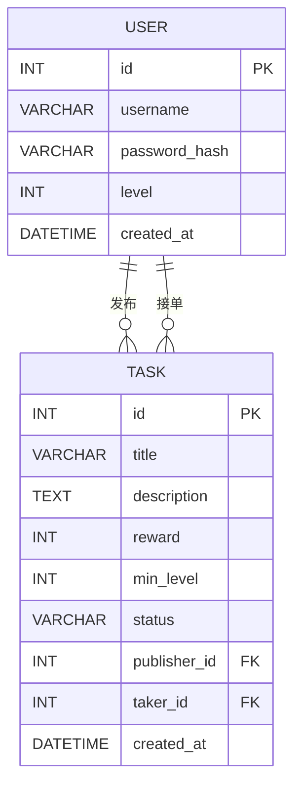

# 任务悬赏系统 ER 图


```mermaid
erDiagram
    USER {
        INT id PK
        VARCHAR username
        VARCHAR password_hash
        INT level
        DATETIME created_at
    }
    TASK {
        INT id PK
        VARCHAR title
        TEXT description
        INT reward
        INT min_level
        VARCHAR status
        INT publisher_id FK
        INT taker_id FK
        DATETIME created_at
    }
    USER ||--o{ TASK : "发布"
    USER ||--o{ TASK : "接单"
```
```
